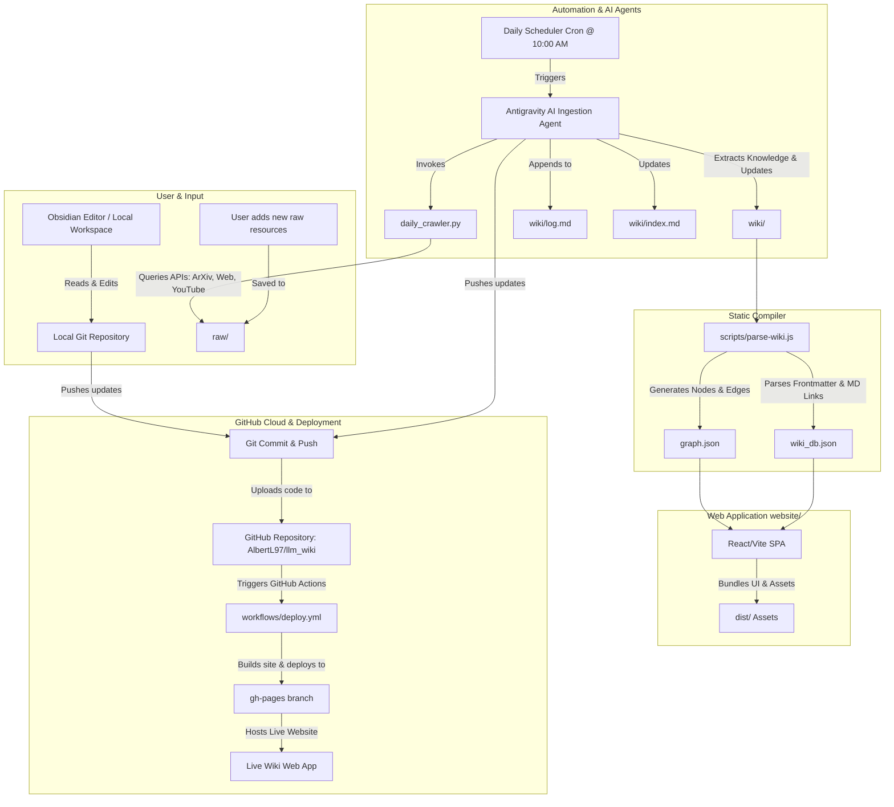

# Human–AI Interaction Psychology Wiki 🧠🤖

An interactive, automated, and source-grounded knowledge base mapping the psychology, attitudes, and behaviors governing human interaction with artificial agents.

**Live Website:** **[https://albertl97.github.io/llm_wiki/](https://albertl97.github.io/llm_wiki/)**

---

## 📌 Project Overview
This repository implements a dynamic, automated knowledge base focused on the psychological layers of human-AI and human-robot interaction (HAI/HRI). 

The structure of the knowledge base is modeled after **Andrej Karpathy's LLM Wiki** design pattern:
1. **Immutable Sources**: Raw research papers, articles, and transcript files are placed in the `raw/` directory and are never edited.
2. **Derived Wiki Pages**: The AI agent processes these sources to extract findings, creating modular, highly interlinked Markdown pages under `wiki/` along with a centralized `wiki/index.md` and transaction history `wiki/log.md`.
3. **Strict Traceability**: Every claim made in the wiki is backed by inline citations referencing the raw source files (e.g. `(source: paper-title.pdf)`).

---

## 🎯 Domain & Research Focus
This wiki focuses specifically on the **psychology of AI interaction**, exploring constructs such as:
- **Trust & Reliance**: Calibration, overtrust, trust repair, and the *explanation-based persuasion paradox*.
- **Anthropomorphism & Social Dynamics**: Human attitudes toward physical robots, virtual avatars, and voice assistants; Duchenne smiles, parasocial bonds, and AI companions.
- **Mental Health & Conversational Agents**: Human-chatbot therapy relationships, user representation compliance (human vs. machine representation), and emotional dependency.
- **Evaluation & Psychometrics**: Standardized metrics (ASRS, CEIA, Godspeed, SHAPE-AI) and physiological workload sensing (EEG, ECG, eye-tracking).

---

## ⚙️ System Architecture



---

## 🛠️ Technology Stack
- **Web App**: React (TypeScript), Vite, CSS Variables (for cyan/purple dark theme).
- **Visualization**: D3-based 2D force-directed node graph (`react-force-graph-2d`) with neon particles mapping the flow of data between connected nodes.
- **Routing**: Client-side hash-based routing (`/#/page/id`) preventing routing issues on GitHub Pages.
- **CI/CD**: GitHub Actions workflow (`deploy.yml`) automating compilation, database generation, and deployment.
- **Crawler**: Python-based automated API crawler querying new publications based on user-approved keyword configurations.

---

## 🚀 How to Run Locally

### 1. Pre-build compiling
Compile your `.md` files in `wiki/` into the client-side JSON databases:
```bash
cd website
node scripts/parse-wiki.js
```

### 2. Start the local dev server
To run the React web application locally:
```bash
cd website
npm install
npm run dev
```

### 3. Run the automated crawler manually
To fetch new paper candidates from ArXiv:
```bash
python scratch/daily_crawler.py
```
This writes candidates to `scratch/new_papers.json` which the agent consumes, summarizes, and incorporates into the wiki on its scheduled run.
